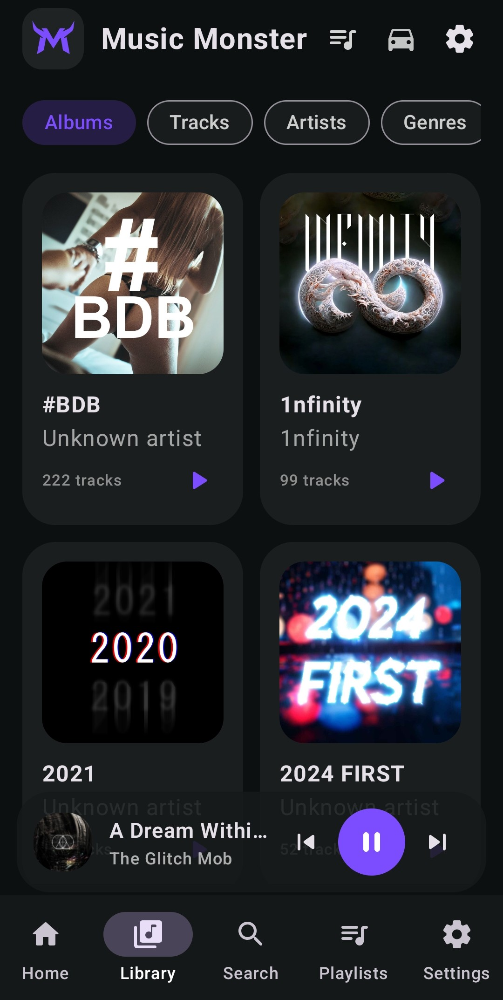
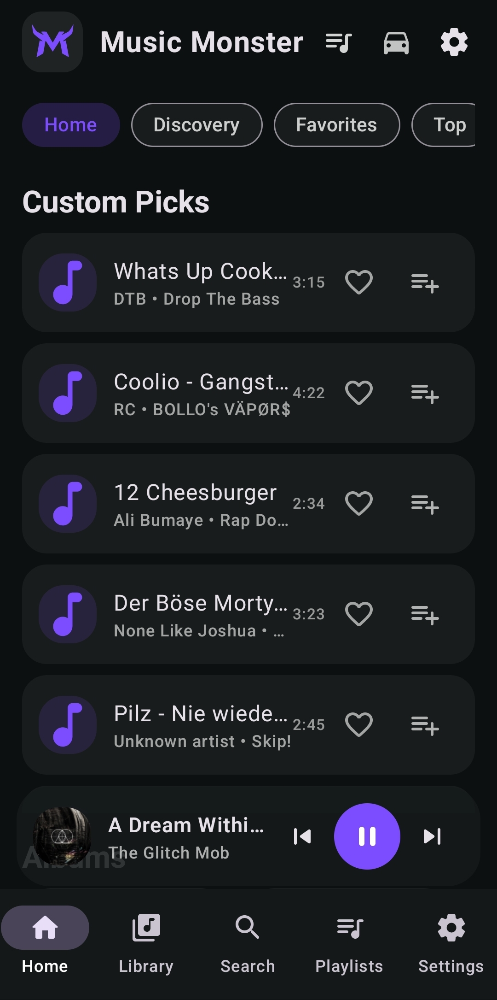
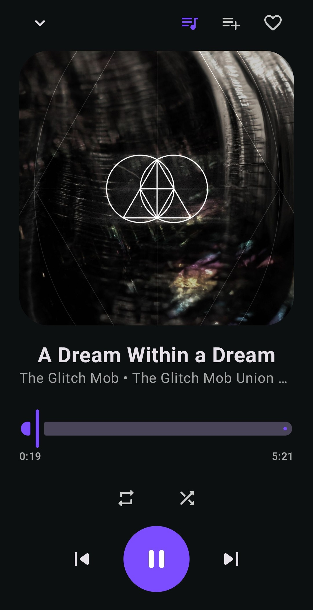
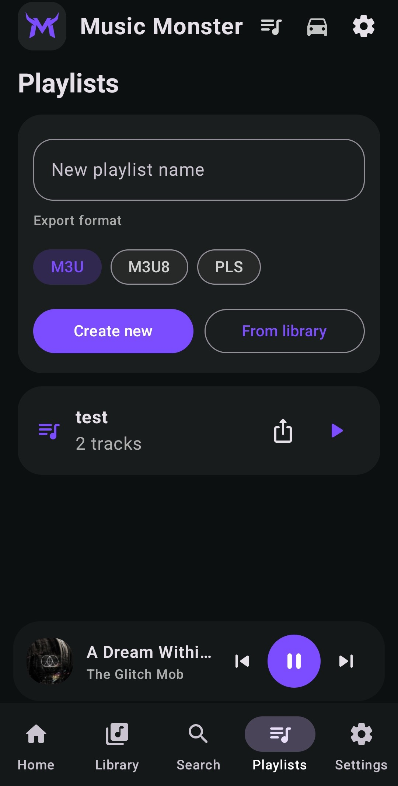
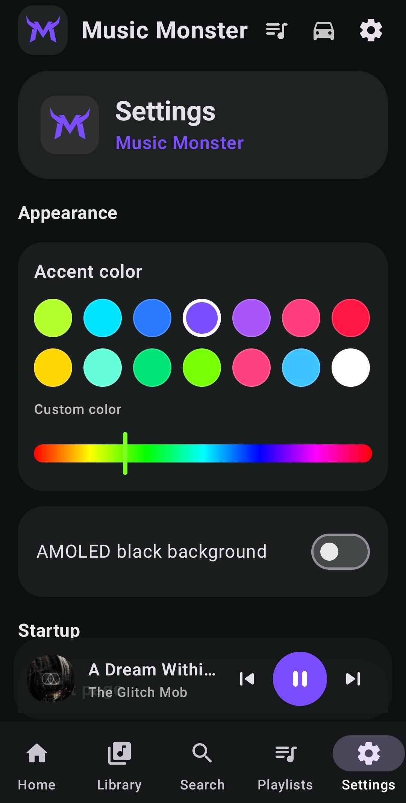
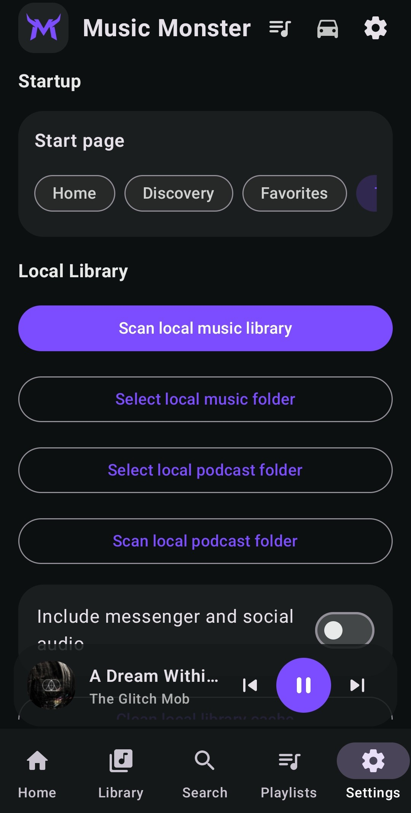
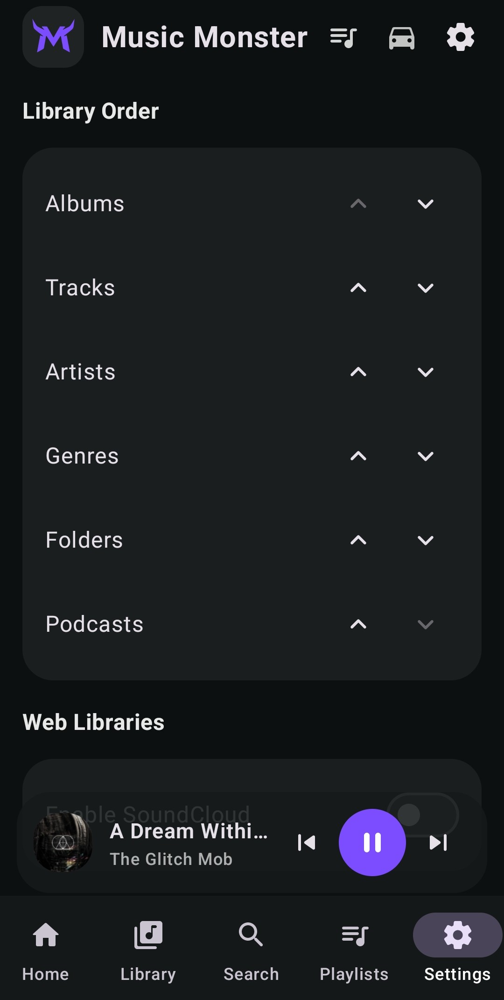
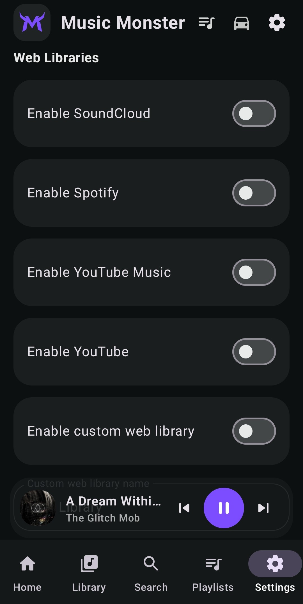
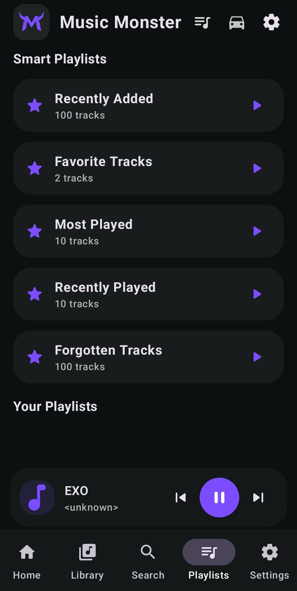
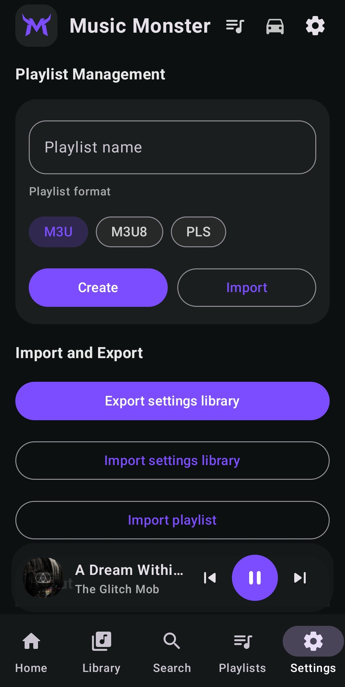

# MusicMonster Android Music Player App

MusicMonster is a modern local-first Android music player.

---

## Previews












---

## Start

Download the prevuild APK from Github Releases page: musicmonster-app-v.2.0.5-release.apk

Install the generated APK on an Android 10+ device.

On first launch, grant the required media permissions when Android asks for them. Depending on the Android version, permission names may differ because Android changed media permission handling in newer versions.

After the app opens, use **Settings → Local Library** to scan your music library or select a specific local music folder.

---

## Main Navigation

MusicMonster uses a mobile-first navigation structure.

### Bottom Navigation

| Home | Personal start page with picks, albums, artists, favorites and recent items |
| Library | Albums, tracks, artists, genres, folders, podcasts and optional web libraries |
| Search | Fast local search across the scanned music library |
| Playlists | Local playlist creation, import and export |
| Settings | Appearance, startup behavior, scanning, web libraries and library order |

### Home Sections

Home can show:

- Discovery-style custom picks
- Albums
- Artists
- Favorites
- Top content
- History-based entries
- Playlist shortcuts

Custom picks are refreshed for a more dynamic start page.

---

## Library

The Library section is split into focused segments.

| Albums | Album grid with artwork fallback and album detail view |
| Tracks | Compact track list for fast browsing |
| Artists | Artist list with track grouping |
| Genres | Genre grouping based on media metadata |
| Folders | Folder-based browsing for local collections |
| Podcasts | Separate local podcast area with its own folder selection |
| Web libraries | Optional SoundCloud, Spotify, YouTube Music or custom web entries |

Album views use embedded artwork when available. If no artwork is found, MusicMonster shows the internal MusicMonster placeholder style.

---

## Playback

MusicMonster includes three player layers.

### Mini Player

The mini player stays available while browsing. It shows the active track and quick controls without blocking the library view.

### Full Player

Tap the mini player to open the full player.

The full player includes:

- large artwork area
- track title and metadata
- progress slider
- previous / play-pause / next controls
- shuffle
- repeat mode
- favorite toggle

Repeat cycles through:

```text
Off → Repeat Track → Repeat Queue → Off
```

### Notification Microplayer

When playback is active, MusicMonster shows Android notification controls with:

- album artwork
- track title
- album, folder or context text
- previous
- play / pause
- next

This allows playback control from the notification shade while the app is in the background.

---

## Favorites, History and Play Counts

MusicMonster keeps local interaction data so the app remains useful after closing and reopening it.

Persisted local data includes:

- scanned music library cache
- selected music folder
- selected podcast folder
- favorites
- playback history
- play counts
- startup page
- accent color
- library order
- appearance settings
- web library settings

The local cache can be cleared from the settings screen when needed.

---

## Podcasts

Podcasts are handled as a separate library type.

In Settings, select a dedicated podcast folder and scan it separately from the main music library. This keeps podcast files separated from albums, tracks and regular music folders.

---

## Web Libraries

MusicMonster can show optional web library entries inside the Library section.

Supported presets:

- SoundCloud
- Spotify
- YouTube Music
- Custom Web Library

The custom web library supports a user-defined name and URL.

These entries are meant as optional convenience views. MusicMonster is not affiliated with SoundCloud, Spotify, YouTube, Google or any other third-party web service.

---

## Local Library Scanning

MusicMonster scans local audio files through Android media APIs and selected folder access.

The scanner is designed to avoid typical messenger and social media voice-message folders by default, including common paths for apps such as WhatsApp and other messaging tools. This can be changed in Settings if those files should be included.

Recommended usage:

1. Open Settings.
2. Select or scan the local music folder.
3. Select a separate podcast folder if needed.
4. Let the scan finish.
5. Browse albums, tracks, artists, genres, folders or podcasts.

---

## Appearance

The default MusicMonster accent color is:

```text
#B6FF2F
```

Accent color affects:

- active navigation pills
- player controls
- sliders
- selected tabs
- favorite states
- logo tint
- placeholder icons
- focused controls

The app includes preset accent colors and a custom color picker.

---

## Car Mode

Car Mode is a simplified control mode for easier interaction while driving or when the device is mounted.

The mode is toggled from the top app bar and focuses the UI more strongly around player controls and quick playback interaction.

Use it responsibly. Do not interact with the app while driving if it is unsafe or illegal in your situation.

---

## Import and Export

MusicMonster includes local import and export features for practical backup and transfer workflows.

Available areas:

- Settings export
- Settings import
- Playlist import
- Playlist export
- M3U-style playlist handling
- local cache reset

The app is designed to stay local-first. It does not require a cloud account for local music playback.

---

## Important Notes

- MusicMonster does not include music files.
- You are responsible for the rights to any audio files you play through the app.
- Web library entries are optional and depend on the behavior of the referenced web services.
- Some web services may restrict login, playback, embedded use or WebView behavior.
- Android media permissions differ between Android versions.
- Artwork availability depends on the metadata embedded in the audio files and on Android media access.
- Very large libraries may take longer to scan on slower devices.
- The app is still a work in progress and may require refinement for specific devices and library structures.

---

## License

Copyright (c) 2026 complicatiion aka sksdesign aka sven404  
All rights reserved unless explicitly granted below or otherwise mentioned/licensed, or generally based on an open-source license.

See further details in:

```text
LICENSE.md
```

Review the license before redistribution, modification, packaging or commercial/internal reuse.

---

### © complicatiion aka sksdesign · 2026

---
